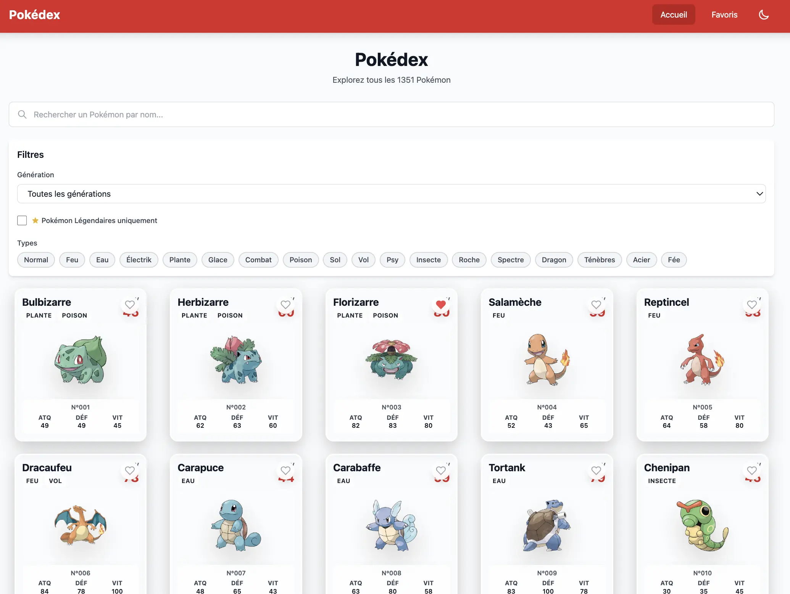

# Pokédex Application

[](https://github.com/ythirion/pokedex/actions/workflows/deploy.yml)
[](https://sonarcloud.io/summary/new_code?id=ythirion_pokedex)
[](https://sonarcloud.io/summary/new_code?id=ythirion_pokedex)
[](https://sonarcloud.io/summary/new_code?id=ythirion_pokedex)
[](https://sonarcloud.io/summary/new_code?id=ythirion_pokedex)
[](https://sonarcloud.io/summary/new_code?id=ythirion_pokedex)

A modern, full-featured Pokédex web application built with SvelteKit, TypeScript, and Tailwind CSS. Browse, search, and explore all 1000+ Pokémon with detailed information, evolution chains, and favorites management.



## Features

- **Complete Pokémon Database**: Browse all 1000+ Pokémon with pagination
- **Search**: Real-time search with debouncing for instant results
- **Filters**: Filter by Pokémon type (18 types) and generation (Gen 1-9)
- **Detailed Views**: View comprehensive information including:
  - Base stats with visual bar charts
  - Types and abilities
  - Height, weight, and base experience
  - Complete evolution chains with triggers
  - High-quality official artwork
- **Favorites**: Save your favorite Pokémon (persisted in localStorage)
- **Responsive Design**: Optimized for mobile, tablet, and desktop
- **Performance**: Aggressive caching and lazy loading for optimal speed

## Tech Stack

- **Frontend**: SvelteKit with TypeScript
- **Styling**: Tailwind CSS
- **API**: PokeAPI (https://pokeapi.co)
- **State Management**: Svelte Stores
- **Build Tool**: Vite

## Getting Started

### Prerequisites

- Node.js 18+ and npm

### Installation

```bash
# Install dependencies
npm install

# Start development server
npm run dev

# Build for production
npm run build

# Preview production build
npm run preview

# Type check
npm run check
```

The application will be available at `http://localhost:5173`

## Project Structure

```
src/
├── lib/
│   ├── components/          # UI Components
│   │   ├── pokemon/         # Pokemon-specific components
│   │   ├── ui/              # Generic UI components
│   │   └── layout/          # Layout components
│   ├── services/            # API and storage services
│   │   ├── api/             # API services
│   │   └── storage/         # LocalStorage services
│   ├── stores/              # Svelte stores
│   ├── types/               # TypeScript definitions
│   ├── utils/               # Utility functions
│   └── constants/           # Constants
├── routes/                  # SvelteKit pages
│   ├── +page.svelte         # Home page (Pokemon list)
│   ├── +layout.svelte       # App layout
│   ├── pokemon/[id]/        # Pokemon detail page
│   └── favorites/           # Favorites page
└── app.css                  # Global styles
```

## Architecture

### Data Flow

```
User Action → Store Action → Service Call → Cache Check →
API Request → Store Update → Component Re-render
```

### Caching Strategy

- **In-Memory Cache**: LRU cache with 500 entry limit and 1-hour TTL
- **LocalStorage**: Persistent favorites across sessions
- **API Optimization**: Batch requests and deduplication

### Performance Optimizations

1. **Pagination**: Load 20 Pokémon per page instead of all 1000+
2. **Lazy Loading**: Images load as they enter viewport
3. **Debouncing**: Search input debounced to 300ms
4. **Progressive Enhancement**: Basic info loads first, detailed data enriches after
5. **Code Splitting**: Automatic route-based code splitting via SvelteKit

## API Usage

This application uses the free [PokeAPI](https://pokeapi.co) service. No API key required.

**Endpoints used:**
- `/pokemon` - List of Pokémon
- `/pokemon/{id}` - Pokémon details
- `/pokemon-species/{id}` - Species information
- `/evolution-chain/{id}` - Evolution chains

## Development

### Type Checking

```bash
npm run check
```

### Building

```bash
npm run build
```

The built application will be in the `.svelte-kit/output` directory.

## Browser Support

- Chrome/Edge (latest)
- Firefox (latest)
- Safari (latest)
- Mobile browsers (iOS Safari, Chrome Android)

## License

MIT

## Credits

- Pokémon data and images from [PokeAPI](https://pokeapi.co)
- Pokémon is a trademark of Nintendo/Creatures Inc./GAME FREAK Inc.
